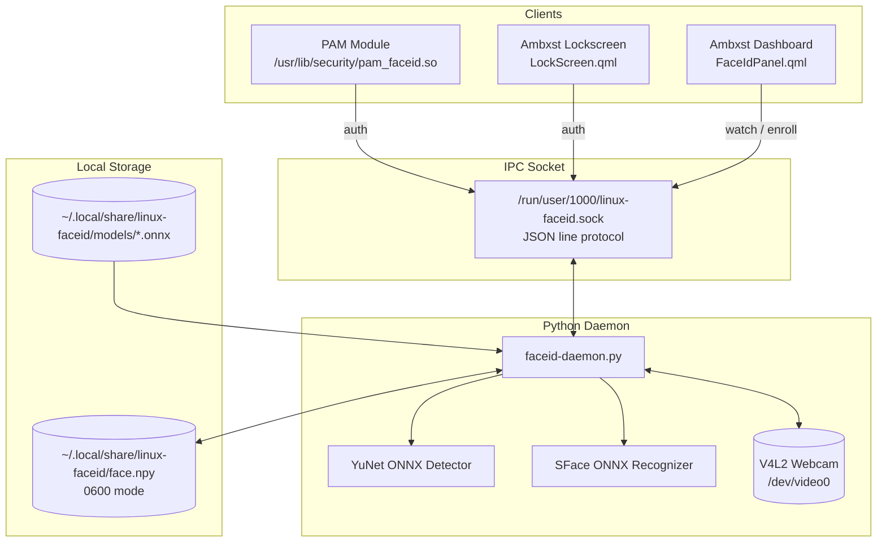

# 👁️ Linux Face ID

> **Fast, fully offline biometric face unlock for Linux desktops, PAM (`doas` / `sudo`), and Ambxst (Hyprland / Quickshell).**

Linux Face ID brings seamless, Windows Hello / Apple Face ID style facial authentication to Linux using local neural networks. No cloud, no proprietary services, and frames never leave your machine.

---

## ✨ Features

- 🧠 **100% Offline AI Face Recognition:** Powered by OpenCV **YuNet** (detection) + **SFace** (recognition) ONNX models running directly on CPU via V4L2.
- 🔐 **Native PAM Module (`pam_faceid`):** Authenticate with your face for `doas` or `sudo`. Instantly falls back to your standard password prompt if your face isn't detected or doesn't match.
- 🔒 **Ambxst Lockscreen Integration:** Custom pill button on the Ambxst (Quickshell / Hyprland) lockscreen with real-time scanning spinner and feedback.
- ⚙️ **Settings Dashboard Panel:** Embedded QML dashboard control to preview live camera recognition, check similarity scores, and enroll or reset your face profile.
- 🛡️ **Hardened Hardware & Daemon Watchdogs:**
  - Non-blocking, threaded camera initialization (`CAMERA_OPEN_TIMEOUT`) and stream stall detection (`CAMERA_STALL_TIMEOUT`) so flaky USB cameras won't lock up your desktop.
  - Reentrant, deadlock-free Unix domain socket broadcaster with send timeouts (`SO_SNDTIMEO`).
  - Udev rule to prevent Logitech C922 / UVC webcams from stalling under USB power autosuspend.

---

## 🏗️ Architecture



---

## 📦 Requirements & Multi-Distro Installation

Install the required build tools, PAM development headers, Python 3, OpenCV, and NumPy using your distribution's package manager:

### Arch Linux / Manjaro / EndeavourOS
```bash
sudo pacman -S --needed gcc make pam python python-opencv python-numpy
```

### Debian / Ubuntu / Linux Mint / Pop!_OS
```bash
sudo apt update
sudo apt install -y build-essential libpam0g-dev python3 python3-opencv python3-numpy
```

### Fedora / RHEL / CentOS / Alma / Rocky
```bash
sudo dnf install -y gcc make pam-devel python3 python3-opencv python3-numpy
```

### openSUSE (Tumbleweed & Leap)
```bash
sudo zypper install -y gcc make pam-devel python3 python3-opencv python3-numpy
```

### Void Linux
```bash
doas xbps-install -S base-devel pam-devel python3 opencv python3-numpy
```

### Gentoo
```bash
sudo emerge --ask sys-devel/gcc sys-devel/make sys-libs/pam dev-python/numpy media-libs/opencv
```

### Alpine Linux
```bash
doas apk add build-base linux-pam-dev python3 py3-numpy py3-opencv
```

---

## 🚀 Quick Install

### 1. Clone the repository
```bash
git clone https://github.com/ihatenosebleedz/linux-faceid.git
cd linux-faceid
```

### 2. Run the universal installer
```bash
./install.sh
```

The script will:
1. Verify system build tools and Python libraries.
2. Stage the ONNX face detection and recognition models into `~/.local/share/linux-faceid/`.
3. Compile and install `pam_faceid.so` to `/usr/lib/security/`.
4. Install the USB autosuspend prevention rule in `/etc/udev/rules.d/` (for Logitech webcams).
5. If [Ambxst](https://github.com/ambxst/ambxst) is installed, automatically install and enable the desktop mod!

---

## 👤 Enrolling Your Face

### Option A: Via Ambxst Dashboard
1. Open the Ambxst settings/dashboard.
2. Navigate to **Face ID**.
3. Click **Enroll** and look directly at your webcam for ~2 seconds while it captures 20 sample frames.

### Option B: Standalone / Terminal
If you are running another desktop environment (GNOME, KDE Plasma, Sway, Hyprland without Ambxst):
1. Start the daemon in a terminal or systemd/runit user service:
   ```bash
   python3 payload/scripts/faceid-daemon.py
   ```
2. In another terminal, trigger enrollment:
   ```bash
   python3 -c '
   import socket
   s = socket.socket(socket.AF_UNIX, socket.SOCK_STREAM)
   s.connect("/run/user/1000/linux-faceid.sock")
   s.sendall(b"{\"command\":\"enroll\"}\n")
   s.close()
   '
   ```
3. Look directly into the camera until the daemon prints `Enrollment complete`.

---

## 🔑 Configuring PAM (`doas` / `sudo`)

To authenticate elevated terminal commands with your face:

### For `doas` (/etc/pam.d/doas)
Add `auth sufficient pam_faceid.so` at the **top** of `/etc/pam.d/doas`:

```pam
#%PAM-1.0
auth            sufficient      pam_faceid.so
auth            include         system-auth
account         include         system-auth
session         include         system-auth
```

### For `sudo` (/etc/pam.d/sudo)
Add `auth sufficient pam_faceid.so` as the first `auth` rule:

```pam
#%PAM-1.0
auth            sufficient      pam_faceid.so
auth            include         system-auth
account         include         system-auth
session         include         system-auth
```

*(On Debian/Ubuntu, replace `system-auth` with `common-auth`; on Fedora, replace with `password-auth`).*

> **Note:** Because it is marked `sufficient`, a matching face instantly grants authorization. If no face is detected or recognition fails, PAM falls right through to your standard password prompt without delay!

---

## 🛠️ Socket Protocol Specification

The daemon listens on `$XDG_RUNTIME_DIR/linux-faceid.sock` (fallback `/run/user/<uid>/linux-faceid.sock`) using newline-delimited JSON.

### Commands (Client → Daemon)
| Command | Description |
|---|---|
| `{"command": "auth"}` | Requests one-shot authentication. Opens camera, verifies face against profile, returns `auth_result` to caller, and closes camera. |
| `{"command": "status"}` | Requests an immediate state snapshot. |
| `{"command": "watch:on"}` | Keeps camera open for live stream preview / verification testing. |
| `{"command": "watch:off"}` | Closes camera stream. |
| `{"command": "enroll"}` | Initiates a 20-frame face enrollment process. |
| `{"command": "clear"}` | Deletes the enrolled face embedding (`face.npy`). |
| `{"command": "cancel"}` | Cancels an ongoing enrollment or one-shot auth. |

### Events (Daemon → Clients)
| Event | Description |
|---|---|
| `{"event": "state", "data": {...}}` | Broadcasts full daemon state (FPS, faces detected, recognition score, camera status). |
| `{"event": "auth", "data": {"status": "pending" / "success" / "failed"}}` | Broadcast notification for shell UI status display. |
| `{"event": "auth_result", "data": {"ok": true / false, "score": 0.401}}` | Direct unicast reply targeted specifically at the auth requester. |

---

## 🐛 Troubleshooting

### Webcam Stalling / LED Stays On (Logitech C920 / C922)
Many UVC webcams lock up their microcontroller when waking from USB power-saving mode. Ensure the provided udev rule is installed:
```bash
sudo cp udev/99-logitech-c922.rules /etc/udev/rules.d/
sudo udevadm control --reload-rules
sudo udevadm trigger --subsystem-match=usb
```
Verify autosuspend is disabled (`power/control` should read `on`):
```bash
cat /sys/bus/usb/devices/3-3/power/control
```

### Camera Device Override
By default, the daemon opens `/dev/video0`. If your webcam is on another node:
```bash
FACEID_CAMERA=/dev/video2 python3 payload/scripts/faceid-daemon.py
```

---

## 📄 License

MIT © [ihatenosebleedz](https://github.com/ihatenosebleedz)
